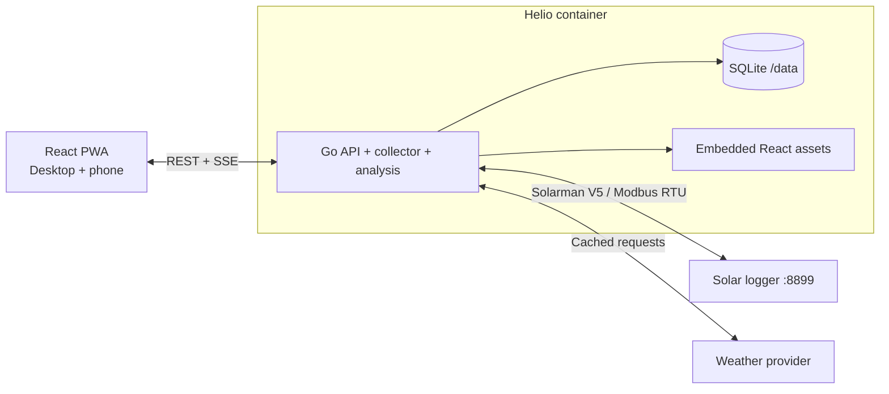

# Helio

Local-first solar monitoring for Solarman/SOFAR systems. Built with Go, React, SQLite, and Docker.

> [!IMPORTANT]
> Helio is currently in design phase. No production image exists yet. Follow the roadmap or join a discussion if you want to help build the first release.

## Why Helio?

Vendor solar apps often hide useful telemetry behind slow cloud interfaces and weak history views. Helio is designed to talk directly to a Solarman V5 logger on your local network, preserve your own data, and explain system health without depending on vendor cloud availability.

## Planned features

- Live inverter and PV string telemetry
- Independent minute, daily, monthly, and yearly history
- Weather-adjusted production expectations
- Clear alerts for stale data, faults, and persistent underproduction
- Estimated production value using a configurable tariff
- Responsive light/dark interface for desktop and phone
- Local authentication
- CSV export and documented local API
- Single-container deployment with persistent SQLite storage
- Future Telegram, Home Assistant, remote access, and guarded Modbus controls

## Reference hardware

Initial validation targets a SOFAR 6KTLM-G3 inverter connected through a Solarman V5 Wi-Fi logger on TCP port 8899. Architecture keeps protocol and register maps isolated so additional Solarman-compatible hardware can be added safely.

## Architecture

One Go process serves the API, SSE live stream, embedded React app, collector, scheduler, and analysis engine. A multi-stage build produces one minimal image; `/data` holds durable state.

## Technology

- Go backend
- React + TypeScript + Vite
- TanStack Router and TanStack Query
- SQLite in WAL mode
- Server-Sent Events for live telemetry
- Docker multi-stage build

## Roadmap

1. Solarman V5 read-only transport and SOFAR register validation
2. Persistent collector, authentication, REST API, and SSE
3. Responsive Now and History views
4. Weather-aware insights and internal alerts
5. Stable Docker image and documented self-hosting
6. Telegram, Home Assistant, remote access, and guarded controls

Detailed approved design: [Helio local solar monitor design](docs/superpowers/specs/2026-07-14-helio-local-solar-monitor-design.md).

## Contributing

Helio welcomes protocol captures, register documentation, hardware testing, design feedback, documentation, and code. Read [CONTRIBUTING.md](CONTRIBUTING.md) before opening a pull request.

For support questions, use [GitHub Discussions](https://github.com/ndelanhese/helio/discussions). Report security issues privately as described in [SECURITY.md](SECURITY.md).

## Safety

MVP is read-only. Inverter writes can change grid-protection or operating parameters and may damage equipment or violate local rules. Future write support must use explicit allowlists, confirmation, read-back verification, and audit logs.

## License

Licensed under [Apache License 2.0](LICENSE).

