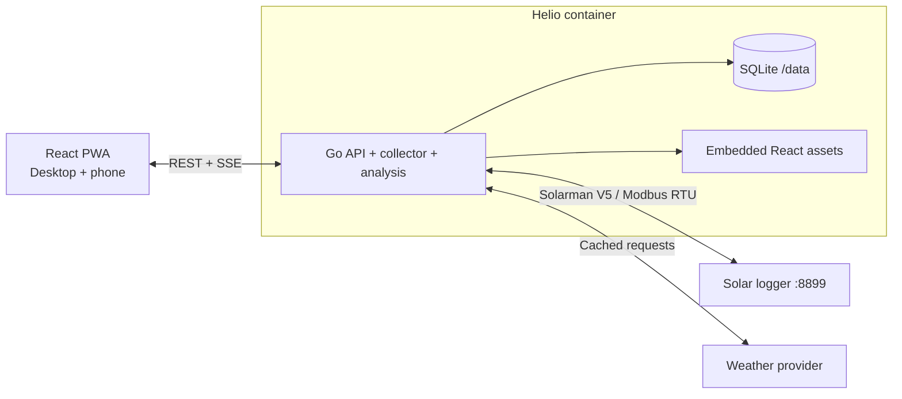

# Helio

Local-first solar monitoring for Solarman/SOFAR systems. Built with Go, React, SQLite, and Docker.

> [!IMPORTANT]
> Helio v0.1 is a release candidate available as source. No `v0.1.0` tag or GHCR image is claimed until the release workflow publishes it. Build this checkout for evaluation, keep it on a trusted private LAN, and back up before upgrades.

## Why Helio?

Vendor solar apps often hide useful telemetry behind slow cloud interfaces and weak history views. Helio is designed to talk directly to a Solarman V5 logger on your local network, preserve your own data, and explain system health without depending on vendor cloud availability.

“Local-first” describes telemetry ownership, storage, and inverter access—not a fully offline process. Weather-aware analysis makes an outbound HTTPS request about once per hour to Open-Meteo, sending the configured latitude/longitude and bounded dates. Raw inverter telemetry, credentials, logger identity, and database contents are not sent. See [Privacy](docs/privacy.md) for the exact boundary.

## Release-candidate features

- Live inverter and PV string telemetry
- Independent minute, daily, monthly, and yearly history
- Weather-adjusted production expectations
- Clear alerts for stale data, faults, and persistent underproduction
- Estimated production value using a configurable tariff
- Finance dashboard with explicit official-tariff approval, bill reconciliation, and credit-expiry visibility
- Responsive light/dark interface for desktop and phone
- Local authentication
- CSV export and documented local API
- Single-container deployment with persistent SQLite storage
- Read-only Solarman/SOFAR access; no inverter write endpoints

## Reference hardware

Initial validation targets a SOFAR 6KTLM-G3 inverter connected through a Solarman V5 Wi-Fi logger on TCP port 8899. Architecture keeps protocol and register maps isolated so additional Solarman-compatible hardware can be added safely.

## Architecture

One Go process serves the API, SSE live stream, embedded React app, collector, scheduler, and analysis engine. A multi-stage build produces one minimal image; `/data` holds durable state.

## Technology

- Go backend
- React + TypeScript + Vite
- TanStack Router and TanStack Query
- SQLite in WAL mode
- Server-Sent Events for live telemetry
- Docker multi-stage build

## Install and operate

The source checkout runs with `docker compose up -d` and binds to localhost by default. Start with [Install](docs/install.md), then keep [Operations](docs/operations.md), [Privacy](docs/privacy.md), [Backup and restore](docs/backup-restore.md), [Hardware testing](docs/hardware-testing.md), and the [local API](docs/api.md) nearby.

Future release image commands are documented but clearly conditional on publication. Do not assume `ghcr.io/ndelanhese/helio:v0.1.0` exists until the matching GitHub release and immutable digest are visible.

## Roadmap

1. Solarman V5 read-only transport and SOFAR register validation
2. Persistent collector, authentication, REST API, and SSE
3. Responsive Now and History views
4. Weather-aware insights and internal alerts
5. Publish the tested multi-architecture Docker image and documented self-hosting release
6. Telegram, Home Assistant, remote access, and guarded controls

Detailed approved design: [Helio local solar monitor design](docs/superpowers/specs/2026-07-14-helio-local-solar-monitor-design.md).

## Contributing

Helio welcomes protocol captures, register documentation, hardware testing, design feedback, documentation, and code. Read [CONTRIBUTING.md](CONTRIBUTING.md) before opening a pull request.

For support questions, use [GitHub Discussions](https://github.com/ndelanhese/helio/discussions). Report security issues privately as described in [SECURITY.md](SECURITY.md).

## Safety

MVP is read-only. Inverter writes can change grid-protection or operating parameters and may damage equipment or violate local rules. Future write support must use explicit allowlists, confirmation, read-back verification, and audit logs.

## License

Licensed under [Apache License 2.0](LICENSE).
